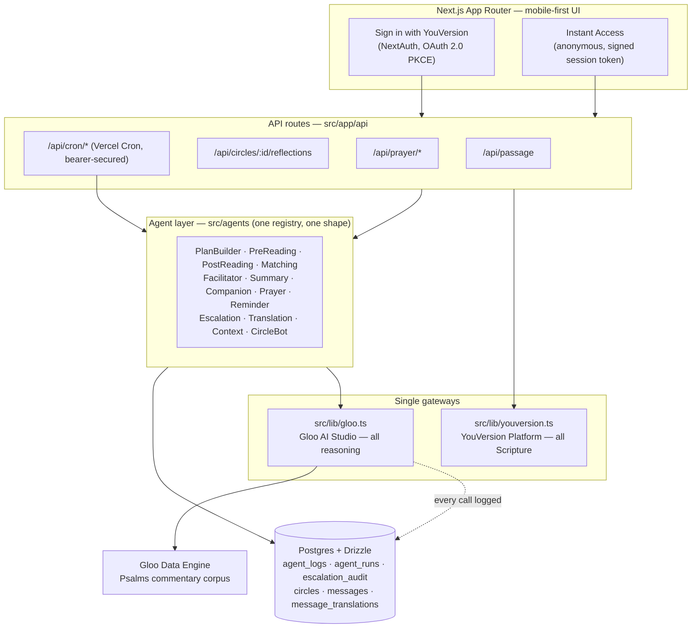

# Round

**AI-facilitated Scripture reading circles.** Round puts small groups through the
same Bible reading plan together, facilitated by a team of specialised AI agents.
It is not a Bible reader — it is the social and facilitation layer that sits on
top of reading, the same relationship Strava has to running.

| | |
|---|---|
| **Live demo** | **https://yv-gloo-chalange.vercel.app** — no account needed, tap **Instant Access** |
| **Video** | **https://www.youtube.com/watch?v=YzcBW4xfzeM** |
| **Competition** | Scripture in New Frontiers — Gloo AI + YouVersion on Kaggle, July 2026 |

Built on two APIs: the **YouVersion Platform API** (all Bible text, versions,
OAuth, highlights) and the **Gloo AI Studio API** (all model reasoning, values-
aligned completions, RAG-grounded commentary). No other model provider is used
anywhere in the codebase.

---

## Try it in 60 seconds

No sign-up required — Instant Access is a full product experience, not a tour of
screenshots. Every AI call is live and every passage is fetched live.

1. Open [the demo](https://yv-gloo-chalange.vercel.app) and tap **Instant Access**.
2. Pick a language and Bible version (try **Spanish / RVES** — the passage arrives
   in Spanish from YouVersion, never translated into it). See
   [Bible version licensing](#bible-version-licensing) for why some versions in
   the picker are greyed out.
3. Open today's reading. **Pre-reading prompts** are generated for you before the
   text.
4. Read, highlight a phrase, then finish. **Conversation starters** are generated
   from the passage and what you highlighted.
5. Post a reflection in the public demo circle. The **Escalation Agent** screens
   it before anything else touches it, and a seeded AI circle member replies.
6. Open the **Prayer** tab and generate a prayer grounded in your own reading.

Sign in with YouVersion instead to get persistence, highlight import, AI-matched
circles, custom AI-generated plans, and reminders.

---

## Where the two APIs are used

The brief sets two hard architectural rules. Both are checkable in one click.

### Rule: Gloo is the only LLM gateway

Every model call in the app goes through one module — [src/lib/gloo.ts](src/lib/gloo.ts).
It handles OAuth2 client-credentials token exchange, retries, guardrail and
refusal detection, and writes an `agent_logs` row for every call, success or
failure, before returning. No other module talks to any model provider.

```
$ grep -rniE "\b(openai|anthropic|@ai-sdk|mistral|cohere)\b" src package.json
src/lib/gloo.ts:13:// - Completions V2 is OpenAI-shaped (messages/choices/usage) plus Gloo-only
src/lib/gloo.ts:15://   the response. Plain fetch is used rather than the OpenAI SDK so those
src/lib/gloo.ts:134:   * Specific Gloo model, e.g. "gloo-openai-gpt-4o". When omitted the client
```

Three hits, all comments in the Gloo client itself: no provider SDK is installed
and no other provider is ever called. Plain `fetch` is used rather than the
OpenAI SDK precisely so that Gloo-only fields (`auto_routing`, `model_family`,
`tradition`, routing metadata) stay first-class and no other provider's package
enters the repository.

| Gloo capability | Endpoint | Used by |
|---|---|---|
| Completions V2 | `/ai/v2/chat/completions` | every agent below |
| Data Engine Search | `/ai/v1/data/search` | corpus retrieval — [context.ts](src/agents/context.ts), [passage-qa.ts](src/lib/passage-qa.ts), [corpus.ts](src/lib/corpus.ts) |
| Grounded Completions (RAG) | `/ai/v2/chat/completions/grounded` | [/api/dev/grounded](src/app/api/dev/grounded/route.ts) |
| Streaming completions | `chatCompletionStream()` | [/api/prayer/generate](src/app/api/prayer/generate/route.ts) |

The retrieval path is deliberately **Search + Completions V2 rather than one-call
Grounded Completions**: Search returns chunk-level hits carrying the parent
item's identity, which is what lets the Context Agent scope retrieval to exactly
one corpus file instead of hoping semantic similarity stays on the right Psalm.
Grounded Completions offers no metadata filtering. The rationale is written up in
the module header of [src/agents/context.ts](src/agents/context.ts).

### Rule: YouVersion is the only source of Bible text

All Scripture goes through [src/lib/youversion.ts](src/lib/youversion.ts). No
translation is embedded, hardcoded, or cached as text in this repository, and
Bible text is **never** passed to Gloo for translation. Language is carried by
the YouVersion **version ID**, which encodes both language and translation — so
a Spanish reader gets a Spanish translation directly from YouVersion, not English
translated after the fact.

| YouVersion capability | Function | Used for |
|---|---|---|
| Passages | `fetchPassage()` | every passage view, in the user's version |
| Passages (validation) | `validatePassageReference()` | validating every AI-generated plan day before it is saved |
| Bible Versions | `listBibleVersions()`, `fetchVersion()` | language-driven version picker |
| Bible index | `fetchBibleIndex()` | book/chapter navigation |
| User Highlights | `fetchChapterHighlights()` | opt-in highlight import for personalisation |
| Sign In with YouVersion (OAuth 2.0, PKCE) | [src/lib/auth.ts](src/lib/auth.ts) | authentication |
| Deep links | `passageDeepLink()` in [/api/passage](src/app/api/passage/route.ts) | "Open in Bible App" on every passage |
| Version copyright | [src/lib/version-attribution.ts](src/lib/version-attribution.ts) | publisher attribution shown wherever Bible text is displayed |

The Translation Agent has a matching guard from the other side: it only ever
receives user-generated circle content, never Scripture — see the module header
in [src/agents/translation.ts](src/agents/translation.ts).

### Bible version licensing

A YouVersion app key can only *fetch* translations whose licence has been granted
to it in the platform dashboard. Round's curated catalogue lists the translations
the brief asks for, each carrying the licence state verified live against the API
— [src/config/bible-versions.ts](src/config/bible-versions.ts).

On the deployment linked above, one version per language is licensed today:

| Language | Selectable now | In the picker, disabled pending licence |
|---|---|---|
| English | **BSB** | NIV, KJV, NASB2020, AMP |
| Spanish | **RVES** | NVI, LBLA |
| Portuguese | **BLT** | NVI-PT |

Unlicensed versions are shown but disabled rather than hidden, and
`effectiveVersionId()` resolves any request to a version that will actually
fetch: an explicitly chosen version wins while it stays licensed, otherwise the
language default, otherwise the licensed fallback for that language. So a reader
always gets Scripture in their own language, and granting a licence later is a
one-flag change with no code path to rewrite.

---

## Architecture



Two invariants hold by construction rather than by convention:

- **Every agent output is logged.** `chatCompletion()` writes to `agent_logs`
  before returning, so an agent cannot produce output without a log row.
- **Nothing double-fires.** Scheduled agents claim an idempotency slot in
  `agent_runs` keyed by (agent, target, period), so re-running a sweep on the
  same input is a no-op — see [src/lib/cron-sweeps.ts](src/lib/cron-sweeps.ts).

---

## The agents

Sixteen agents in one registry ([src/agents/index.ts](src/agents/index.ts)), all
sharing one shape, plus the icebreaker generator alongside them. Each has its own
trigger, system prompt, and output contract.

| Agent | Trigger | Responsibility | Status |
|---|---|---|---|
| [PlanBuilder](src/agents/plan-builder.ts) | Onboarding, on request | Day-by-day plan from the user's goals; every reference validated against YouVersion before saving, failures regenerated | live |
| [PreReading](src/agents/pre-reading.ts) | User opens a passage | 2–3 personal prompts from the passage, goals, and imported highlights; never shared with the circle | live |
| [PostReading](src/agents/post-reading.ts) | First member finishes a reading | 2–3 circle-facing discussion starters grounded in the passage and that reader's highlights | live |
| [Matching](src/agents/matching.ts) | "Match me" | Compares the onboarding profile against open circles, returns the best fit with an explanation shown before joining | live |
| [Icebreaker](src/agents/icebreaker.ts) | Circle reaches minimum size | One opening message referencing something specific two members actually wrote — no blank "say hi" state | live |
| [Facilitator](src/agents/facilitator.ts) | Daily, per circle | Digest: collective synthesis, overlap callout naming who landed on the same theme, one grounded discussion question | live |
| [Summary](src/agents/summary.ts) | Alongside the digest | 3–5 sentence plain-language summary of the passage's main teaching | live |
| [Companion](src/agents/companion.ts) | 12-hourly, stalled circles | Keeps a quiet thread alive with one short warm turn picking up what a member said | live |
| [Prayer](src/agents/prayer.ts) | On request | Daily, custom, or circle-grounded prayer; private by default, shared only by explicit action | live |
| [Reminder](src/agents/reminder.ts) | Daily sweep, per user | Personalised nudge when 2+ days behind, or a summary of unread messages. In-app notifications | live |
| [Escalation](src/agents/escalation.ts) | **Every reflection, first** | Crisis-signal detection; private support card to that user only, never the circle; logs the reference, never the text | live |
| [Translation](src/agents/translation.ts) | Every new user message | Translates into each distinct reader language, caches one row per (message, language), never touches Scripture, never overwrites the original | live |
| [Context](src/agents/context.ts) | Before the Facilitator, Psalms | Retrieves commentary from the RAG corpus, restates archaic language in plain modern English, hands it to the Facilitator as grounding | live |
| [CircleBot](src/agents/circle-bot.ts) | Demo circle activity | A seeded AI *member* (not "Round") so an anonymous visitor who posts is answered like they would be in a living circle | live |
| [Health](src/agents/health.ts) | 12-hourly, per circle | Autonomous circle classification and nudge/bridge/merge decisions | stub |
| [Flashcard](src/agents/flashcard.ts) | On request | 3–5 card deck from the passage | stub |
| [Memory](src/agents/memory.ts) | Periodic, per user | Scores old highlights for relevance and surfaces an "Echo" | stub (Tier 3) |

The three stubs implement the full agent interface, so adding their bodies
requires no structural change — that was a design constraint from day one, not a
retrofit.

### Agent Console

`/dev/agents` runs any agent against live input and shows the prompt, the routed
model, the output, and the log row. It is gated by
[src/lib/dev-gate.ts](src/lib/dev-gate.ts) — enabled locally and on preview
deployments, disabled on production.

---

## Safety and design constraints

- **The Escalation Agent runs first on every reflection**, before any other
  processing — enforced in one place, [src/lib/reflections.ts](src/lib/reflections.ts),
  which fails safe if no verdict can be produced. Crisis resources are hardcoded
  and cover the US (988) and UK (Samaritans 116 123) at minimum —
  [src/config/crisis-resources.ts](src/config/crisis-resources.ts).
  Flagged content never reaches the circle; only the reflection reference is
  logged for audit.
- **No pace or streak comparison between members.** No leaderboard, no visible
  progress bars, no days-read count next to names.
- **Highlight import is opt-in**, explained on a dedicated consent screen
  ([src/app/consent](src/app/consent/page.tsx)) before any import happens.
- **Original messages are never modified.** Translations are additive rows; the
  author's words in their own language are never overwritten.
- **Anonymous sessions persist nothing server-side beyond the session** and are
  pruned on a sweep — [src/lib/anon-prune.ts](src/lib/anon-prune.ts).

---

## Commentary corpus

`corpus/psalms/` holds the RAG corpus the Context Agent retrieves from: one
Markdown file per Psalm, 149 files (the abridged source carries no Psalm 119
section), split from a source PDF by
[scripts/split-psalms-commentary.mts](scripts/split-psalms-commentary.mts) and
uploaded to Gloo's Data Engine by
[scripts/upload-corpus.mts](scripts/upload-corpus.mts).

**Source:** *The Treasury of David* by **Charles Spurgeon** (1834–1892),
originally published 1869–1885. The underlying commentary is **public domain** —
the author died in 1892 and the work is long out of copyright worldwide.

**Edition:** *The Treasury of David (Abridged)*. The source document carries this
notice verbatim on its final page:

> Obtained from www.spurgeon.org. Reformatted and abridged by Eternal Life
> Ministries. Additional Bible-based resources are available at
> www.spurgeongems.org.

The abridgement and reformatting are the work of Eternal Life Ministries, which
distributes it free of charge; redistribution terms for that *edition* rest with
them, while the commentary text it contains is Spurgeon's and is public domain.
Full provenance is recorded in
[corpus/psalms/manifest.json](corpus/psalms/manifest.json) under `provenance`.
The multi-megabyte source PDF is not committed; the split Markdown is the
ingestion input of record.

Digests grounded in this corpus render a source attribution line in the UI.

**Bible text is not in this repository at all.** Every verse is fetched at
runtime from YouVersion in the user's chosen version and remains subject to that
publisher's licence.

---

## Stack

Next.js 16 (App Router) · React 19 · Tailwind 4 · Vercel · Postgres (Neon in
production, Docker locally) · Drizzle ORM · NextAuth v5 with the YouVersion
OAuth provider · Vercel Cron.

## Local development

```bash
npm install
cp .env.example .env.local   # Gloo + YouVersion credentials, secrets
docker compose up -d         # PostgreSQL 16 on localhost:5433
npm run db:migrate           # apply committed migrations
npm run dev                  # http://localhost:3000
```

Round-trip check: `curl localhost:3000/api/health` returns `{"ok":true,...}`
with a database timestamp.

Schema changes: edit [src/db/schema.ts](src/db/schema.ts), `npm run db:generate`
to emit a SQL migration into `drizzle/`, `npm run db:migrate` to apply it.
Migrations are committed and run automatically in the production build
(`npm run build` = `drizzle-kit migrate && next build`).

Corpus rebuild (needs poppler's `pdftotext`):

```bash
npm run corpus:split    # PDF  -> corpus/psalms/*.md + manifest.json
npm run corpus:upload   # manifest -> Gloo Data Engine
```

## Scheduled agents

The Vercel Hobby plan allows two cron jobs, so the cadences are consolidated
behind two dispatchers in [vercel.json](vercel.json). Each cadence also remains a
standalone secured route for individual triggering; `agent_runs` idempotency
means triggering both can never double-fire.

| Cron | Route | Sweeps |
|---|---|---|
| `0 5 * * *` | `/api/cron/daily` | demo refresh, Facilitator + Summary, Reminder |
| `0 6 * * *` | `/api/cron/health` | Health, Companion |

All cron routes require the `CRON_SECRET` bearer token
([src/lib/cron.ts](src/lib/cron.ts)).

## Deployment

Trunk-based, GitHub → Vercel. Feature branch → pull request → automatic preview
deployment → merge to `main` → production. `main` is always deployable.
Environment variables are documented in [.env.example](.env.example) and must be
set for both the Production and Preview environments.

## Project documents

- [round-implementation-brief.md](round-implementation-brief.md) — the full
  product requirements this was built against.
- [round-implementation-plan.md](round-implementation-plan.md) — the stepwise
  implementation plan, including the architectural decisions and their
  rationale (retrieval strategy, scheduling, translation timing, matching
  fallback).

## Licence

Code: [MIT](LICENSE). The commentary corpus and all Bible text carry their own
terms — see [Commentary corpus](#commentary-corpus) above.
